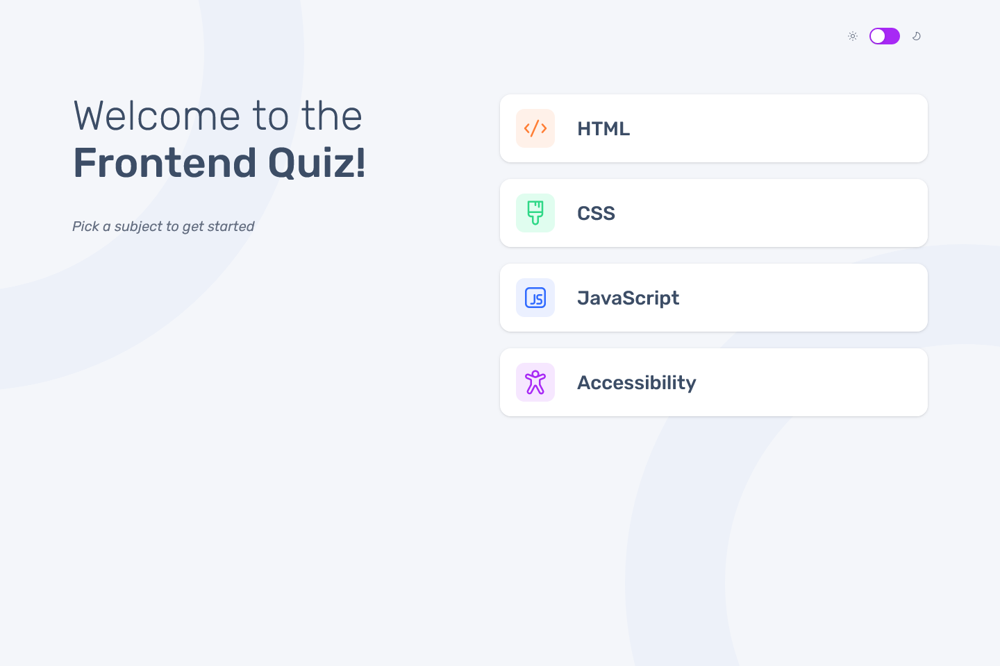

# Frontend Mentor - Frontend quiz app solution

This is a solution to the [Frontend quiz app challenge on Frontend Mentor](https://www.frontendmentor.io/challenges/frontend-quiz-app-BE7xkzXQnU). Frontend Mentor challenges help you improve your coding skills by building realistic projects.

## Table of contents

- [Overview](#overview)
  - [The challenge](#the-challenge)
  - [Screenshot](#screenshot)
  - [Links](#links)
- [My process](#my-process)
  - [Built with](#built-with)
  - [Continued development](#continued-development)
  - [Useful resources](#useful-resources)
- [Author](#author)

## Overview

### The challenge

Users should be able to:

- Select a quiz subject
- Select a single answer from each question from a choice of four
- See an error message when trying to submit an answer without making a selection
- See if they have made a correct or incorrect choice when they submit an answer
- Move on to the next question after seeing the question result
- See a completed state with the score after the final question
- Play again to choose another subject
- View the optimal layout for the interface depending on their device's screen size
- See hover and focus states for all interactive elements on the page
- **Bonus**: Change the app's theme between light and dark

### Screenshot

### Links

- Solution URL: [github](https://github.com/OguzcanKarakoc/frontend-quiz-app-vue)
- Live Site URL: [vercel](https://frontend-quiz-app-vue.vercel.app/)

## My process

### Built with

- Vue
- Tailwindcss
- Pinia
- Vueuse
- Vue router
- Mobile-first workflow
- Love

### Continued development

I havent't added tests yet, this is something I would like to add in the future

### Useful resources

- [github](https://github.com/vueuse/vueuse/issues/3233) - This helped me fix and anoying bug where updating `useDark` would stop the switch transition animation

## Author

- Website - coming soon
- Frontend Mentor - [@OguzcanKarakoc](https://www.frontendmentor.io/profile/OguzcanKarakoc)